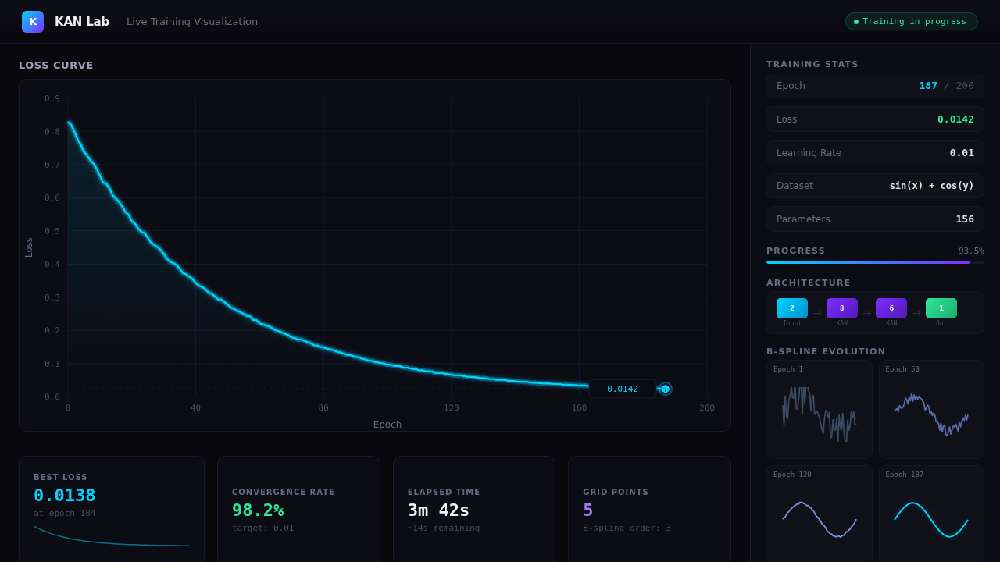
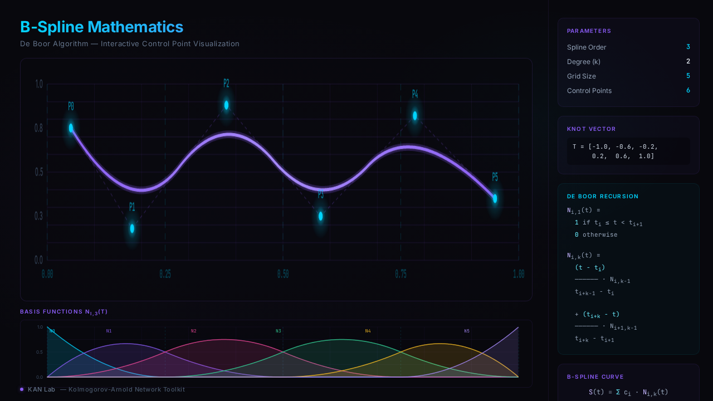

# KAN Lab

在浏览器中构建、训练和可视化 Kolmogorov-Arnold Networks（KAN）。单个 HTML 文件，无需安装，打开即用。

## 什么是 KAN？

KAN（Kolmogorov-Arnold Networks）是 2024 年提出的新型神经网络架构（[Liu et al., ICLR 2025](https://arxiv.org/abs/2404.19756)，3500+ 引用）。与传统 MLP 使用固定激活函数不同，KAN 在每条边上使用**可学习的 B 样条函数**作为激活函数，具有更强的可解释性。

## 功能

- **可视化网络构建** — 添加层和节点，实时预览网络结构
- **实时训练** — 观察 B 样条激活函数从平直线逐渐学习成目标函数的形状
- **KAN vs MLP 对比** — 在相同任务上并排对比两种架构
- **零依赖** — 纯 HTML/CSS/JavaScript，单文件，离线可用

## 快速开始

1. 下载 `index.html`
2. 用浏览器打开
3. 选择目标函数（如 sin(x) + cos(y)）
4. 点击 "Train"，观察 B 样条激活函数的学习过程

无需 Python、无需 npm、无需任何安装。

## 技术实现

- B 样条基函数：Cox-de Boor 递归算法，从零实现
- 训练：Mini-batch SGD，可配置学习率、网格大小、样条阶数
- 可视化：SVG 渲染，requestAnimationFrame 平滑动画
- 无框架、无构建工具

## 完整版

开源版包含核心训练和可视化功能。完整版额外支持：

- 符号回归（从训练结果提取数学公式）
- 高级网络架构
- 更多目标函数

完整版：https://klinstar.gumroad.com/l/kan-lab

## License

MIT
